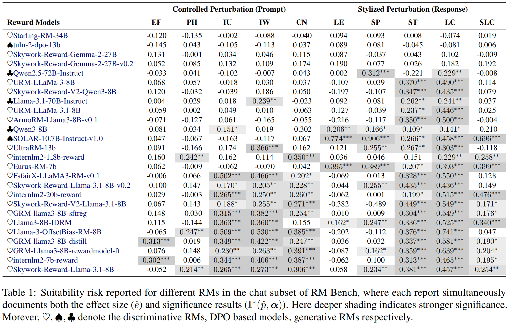
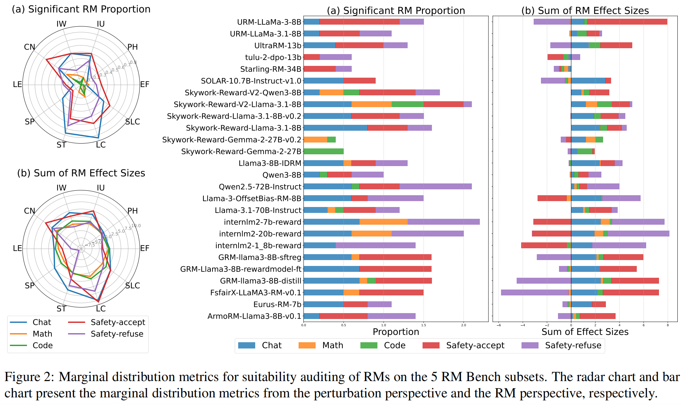

<div align="center">
  <h1>Reward Auditor: Inference on Reward Modeling Suitability in Real-World Perturbed Scenarios</h1>
  <br />
  <span style="color:red">📢 <strong><i>If you are interested in our work, please star ⭐ our project.</i></strong></span>

  <h4>
    <a href="https://arxiv.org/abs/2512.00920"></a>
    
  </h4>
</div>


## 🌈 Introduction


**Reward Auditor** is a novel hypothesis-testing framework designed to evaluate the **suitability**—conditional reliability under real-world perturbations of Reward Models. Moving beyond simple preference accuracy, it employs scientific auditing to quantify the statistical significance and effect size of distribution degradation in RM confidence. By inferring the certainty and severity of systematic vulnerabilities across diverse scenarios, Reward Auditor provides a rigorous foundation for building verifiable, robust, and trustworthy LLM alignment systems.


## 😍 Setup & Evaluation

This project leverages the infrastructure of RM-Bench.

Environment: Follow the setup guide provided in [RewardBench](https://github.com/allenai/reward-bench) and [RM-Bench](https://github.com/THU-KEG/RM-Bench).

Execution: After cloning this repository, use the bash commands below to conduct a Reward Auditor evaluation on RM-Bench:

evaluate the suitability of the reward models:
```bash
bash run_rm_auditing.sh 
```

evaluate the suitability of the dpo based models:

```bash
bash run_dpo_auditing.sh 
```

The results of evaluation will be saved in the dictionary you set in the bash script (parameter `--result_output_dir`).

The results of chat subset of RM Bench:



The results of all 5 subsets of RM Bench:




## 📖Citation

if you find this work helpful, please cite it as:

```
@article{zang2025reward,
  title={Reward Auditor: Inference on Reward Modeling Suitability in Real-World Perturbed Scenarios},
  author={Zang, Jianxiang and Wei, Yongda and Bai, Ruxue and Jiang, Shiyu and Mo, Nijia and Li, Binhong and Sun, Qiang and Liu, Hui},
  journal={arXiv preprint arXiv:2512.00920},
  year={2025}
}
```

