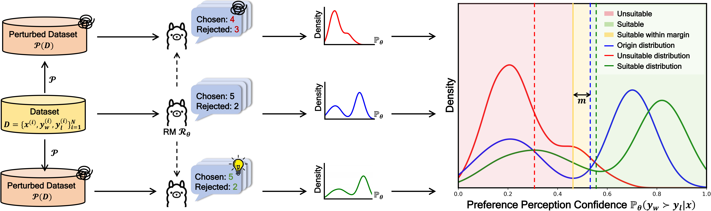

<div align="center">
  <h1>Reward Auditor: Inference on Reward Modeling Suitability in Real-World Perturbed Scenarios</h1>
  <br />
  <span style="color:red">📢 <strong><i>If you are interested in our work, please star ⭐ our project.</i></strong></span>

  <h4>
    <a href="https://arxiv.org/abs/2512.00920"></a>
    
  </h4>
</div>


## 🌈 Introduction


**Reward Auditor** is a novel hypothesis-testing framework designed to evaluate the **suitability**—conditional reliability under real-world perturbations of Reward Models. Moving beyond simple preference accuracy, it employs scientific auditing to quantify the statistical significance and effect size of distribution degradation in RM confidence. By inferring the certainty and severity of systematic vulnerabilities across diverse scenarios, Reward Auditor provides a rigorous foundation for building verifiable, robust, and trustworthy LLM alignment systems.




## 😍 Evaluation

Our codebase is largely based on the Reward Bench and RM Bench Thus for the environment setup, you may follow the instructions in the Reward Bench Setup. After git clone the repository, you can run the following command to evaluate the reward model on RM-Bench with Reward Auditor:

```bash
git clone https://github.com/hggzjx/compression_hacking.git
cd compression_hacking
# pip install .
pip install -e . # install in editable mode
```

Then, you can directly use the following evaluation script (Python) for assessment, or simply run the demo.py file.

```python
import os
from prettytable import PrettyTable
from inf_evaluator import InfEvaluator

# --- 1. Configuration Area ---
# Define the list of model paths to be evaluated
model_list = [
    "facebook/opt-13b",
    "facebook/opt-6.7b",
    "facebook/opt-1.3b"
]

# Define the list of metrics to be evaluated
metric_list = ["compression_se", "semantic_cv", "compression_revised"]

# Define the optimization direction for each metric: True means higher is better, False means lower is better
higher_is_better = {
    "compression_se": True,
    "semantic_cv": False,
    "compression_revised": True
}

# --- 2. Data Evaluation and Collection ---
results_data = {}
print("🚀 Starting evaluation for all models, please wait...")

for model_path in model_list:
    # Automatically extract a clean model name from the full path
    model_name = os.path.basename(model_path)
    print(f"Processing model: {model_name}...")
    
    # Initialize a dictionary to store all metric results for the current model
    results_data[model_name] = {}
    
    # Initialize the evaluator
    evaluator = InfEvaluator(model_path=model_path, sample_size=10, batch_size=16)
    
    for metric in metric_list:
        # Perform the evaluation and get the score
        score = evaluator.evaluate(metric=metric)[metric]
        results_data[model_name][metric] = score
        
print("✅ All model evaluations complete!\n")

# --- 3. Find the Best Model for Each Metric ---
best_models = {}
for metric in metric_list:
    # Extract all models and their scores for the current metric
    scores = [(model, results_data[model][metric]) for model in results_data]
    
    # Find the best model based on the metric's optimization direction
    if higher_is_better[metric]:
        # Find the maximum score
        best_model, _ = max(scores, key=lambda item: item[1])
    else:
        # Find the minimum score
        best_model, _ = min(scores, key=lambda item: item[1])
    best_models[metric] = best_model

# --- 4. Visualize Results Using a Table ---
# Create a table object
table = PrettyTable()
# Set the table headers
table.field_names = ["Model", *metric_list]
# Set column alignment
table.align["Model"] = "l"
for metric in metric_list:
    table.align[metric] = "c"

# Populate the table with data
for model_name, metrics in results_data.items():
    row = [model_name]
    for metric in metric_list:
        # Format the number to 4 decimal places
        value_str = f"{metrics[metric]:.4f}"
        # Add a crown emoji if it's the best model for the metric
        if model_name == best_models[metric]:
            value_str += " 👑"
        row.append(value_str)
    table.add_row(row)

print("📊 Detailed Model Performance Report")
print(table)
print("\nNotes:")
print("  - 👑: Indicates the best performing model for the metric.")
print("  - `compression_revised` and `compression_se`: Higher is better.")
print("  - `semantic_cv`: Lower is better.\n")

# --- 5. Generate the Final Summary Report ---
print("📝 Summary Report for Each Metric")
for metric in metric_list:
    # Sort models based on their performance for the current metric
    sorted_models = sorted(
        results_data.keys(),
        key=lambda m: results_data[m][metric],
        reverse=higher_is_better[metric] # Sort in descending/ascending order based on the optimization direction
    )
    
    comparison_str = " > ".join(sorted_models)
    best_model_name = best_models[metric]
    
    print(f"🔹 **{metric}**:")
    print(f"   - **Best Model**: **{best_model_name}**")
    print(f"   - **Performance Ranking**: {comparison_str}\n")
```


## 📝License
Distributed under the Apache-2.0 License. See LICENSE for more information.


## 📖Citation

if you find this work helpful, please cite it as:

```
@article{zang2025compression,
  title={Compression Hacking: A Supplementary Perspective on Informatics Metric of Language Models from Geometric Distortion},
  author={Zang, Jianxiang and Ning, Meiling and Wei, Yongda and Dou, Shihan and Zhang, Jiazheng and Mo, Nijia and Li, Binhong and Gui, Tao and Zhang, Qi and Huang, Xuanjing},
  journal={arXiv preprint arXiv:2505.17793},
  year={2025}
}

